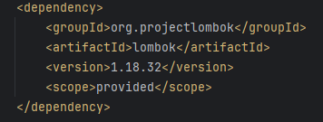
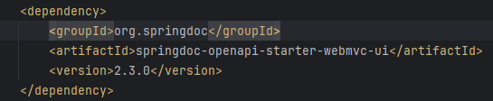
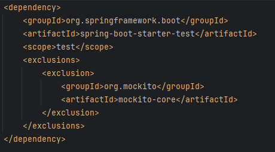
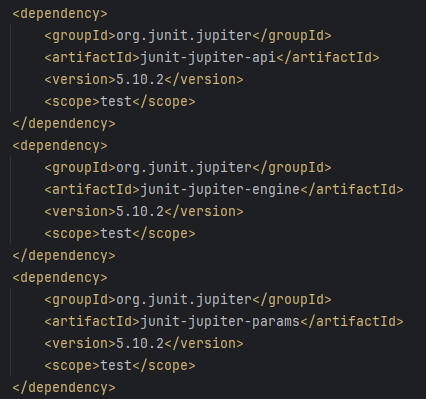
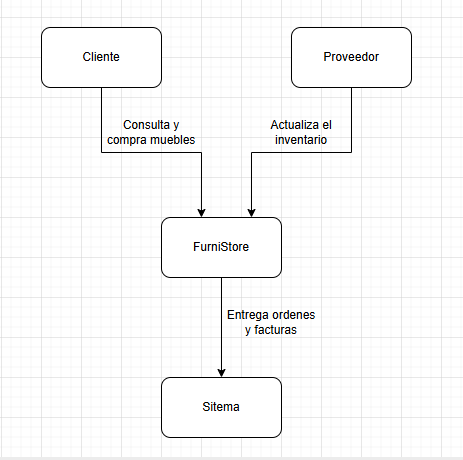
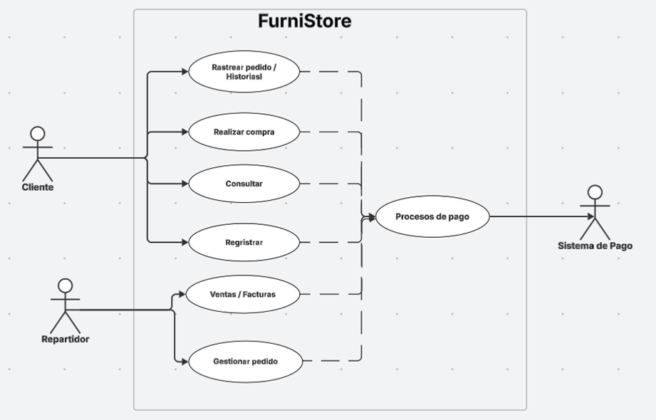
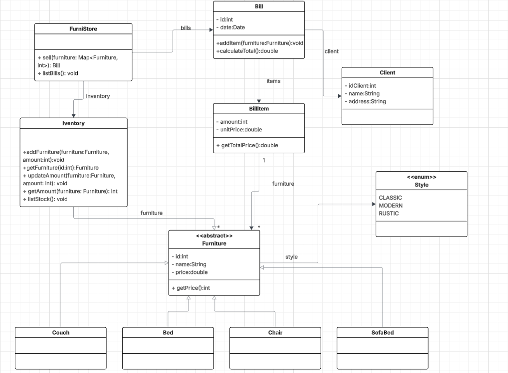

# Enunciado Primer Reto Equipo Rosado
___
## **Integrantes**
* Tomas Felipe Ramirez Alvares
* Manuel Alejandro Guarnizo
* Julian Eduardo Arenas Alfonso
* Daniel Alejandro Rodriguez
* David Eduardo Salamanca

## Descripción del enunciado

* el proyecto FurniStore es una tienda de muebles reconocida que busca digitalizar toda su operacion para mejorar la 
experiencia de sus clientes y tambien optimizar sus procesos internos.Actualmente, la gestion se realiza mediante hojas de
calculos y facturas manuales provocando que hallan errores en los inventarios y la facturacion, demorando entregas y teniendo
faltas de trasabilidad en los pedidos y clientes.
Nuestra solucion tecnologica busca ofreser una api rest estable para la interracion con las facturas, centralizando la 
informacion de los clientes, productos,pedidos y facturacion, asegurando la calidad de software y su robustez aplicando
practicas pertinentes para lograrlo.

## Tecnologia utilizadas:
- java 17
- spring boot
- maven
- mongodb
- swagger
- lombok
- junit5
- jacoco
- mockito
- sonarqube

## Instrucciones de uso:

- clonar el repositorio comando:
  - "git clone url del repositorio"
  - "Entrar y usar maven mvn install"
  - "Ejecuntar la aplicacion con mvn spring-boot:run"

## Flujo de Ramas
___
Se utilizará una estrategia de ramas con la siguiente estructura:

- main: rama principal del proyecto.
- develop: rama de desarrollo.
- feature/: ramas destinadas a nuevas funcionalidades específicas. Por ejemplo, feature/doc se empleará para cambios en la documentación y el archivo README.

El formato de los commits será:
tipoCommit - descripción del cambio

- Los tipos de commit definidos son:
- fix: para la corrección de errores en el código.
- feat: para la incorporación de nuevas funcionalidades.
- doc: para modificaciones relacionadas con la documentación.

## Dependencias utilizadas para nuestro proyecto

Implementación de lombok

Implementación de swagger

Implementación Spring Boot

Implementación pruebas Junit5 

## Diagrama de contexto

El diagrama de contexto, representa la relación que hay entre los usuarios (proveedor y cliente), y el sistema para la 
organización de las ordenes y las facturas. Este es un diagrama simplificado, el cual muestra la interacción principal 
que tiene el sistema.

- **Elementos usados:**
  - Cliente
  - Proveedor
  - FurniStore
  - Sistema

## Diagrama de Casos de Uso y funcionalidades listadas

- Diagrama de Casos de Uso y funcionalidades listadas:

- Funcionalidades:

- CLIENTE
    - Registrar cuenta

Buscar productos y realizar compras

- VENDEDOR
    - Gestionar inventario
    - Procesar ventas
    - Generar facturas

- ADMINISTRADOR
    - Gestionar inventario
    - Ver reportes y estadísticas

- FUNCIONALIDADES
    - Búsqueda avanzada: Filtrar por categoría (sofás, camas, etc.) y estilo (clásico, moderno, etc.)
    - Gestión completa de inventario
    - Proceso de venta integrado con facturación
    - Sistema de reportes para administración

## Diagrama de Clases Preliminar

#### **1. Clase principal: FurniStore**

* Representa a la tienda.
* Contiene un **Inventory** y una lista de **Bills**.

---

#### **2. Inventory**

* Administra los muebles disponibles en la tienda junto con sus cantidades.
* Usa un `Map<Furniture, int>` para asociar cada mueble con su stock disponible.

---

#### **3. Bill y BillItem**

* Bill es un registro generado en cada venta.
* Contiene un identificador, fecha, cliente y una colección de **BillItems**.
* **BillItem**: representa cada línea de la factura.

---

#### **4. Client**

* Representa al comprador.
* Tiene atributos básicos: `idClient`, `name`, `address`.
* Está asociado directamente a la clase **Factura**, porque toda venta debe estar ligada a un cliente.

---

#### **5. Furniture**

* Clase abstracta **Furniture**:

  * Define los atributos comunes: `id`, `name`, `price` y el `style`.
* Subclases concretas:

  * **Couch, Bed, Chair, SofaBed**.
---

#### **6. Style**

* Implementado como un **enum**, donde cada mueble tiene exactamente un estilo asociado.
* Define categorías visuales de los muebles: `CLASSIC`, `MODERN`, `RUSTIC`.
 ---

