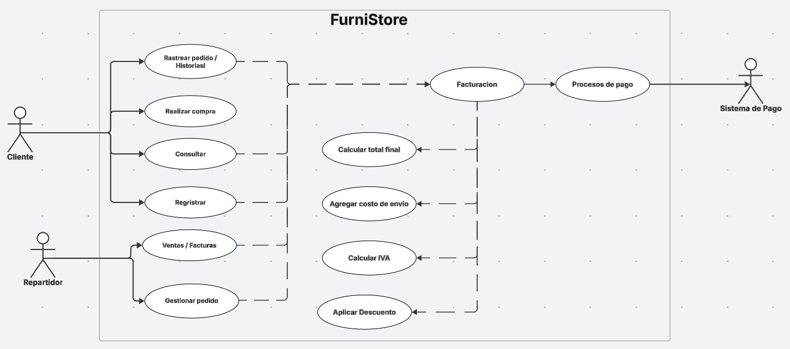

# Enunciado Primer Reto Equipo Rosado
___
## **Integrantes**
* Tomas Felipe Ramirez Alvares
* Manuel Alejandro Guarnizo
* Julian Eduardo Arenas Alfonso
* Daniel Alejandro Rodriguez
* David Eduardo Salamanca Aguilar 

## Descripción del enunciado

* el proyecto FurniStore es una tienda de muebles reconocida que busca digitalizar toda su operacion para mejorar la 
experiencia de sus clientes y tambien optimizar sus procesos internos.Actualmente, la gestion se realiza mediante hojas de
calculos y facturas manuales provocando que hallan errores en los inventarios y la facturacion, demorando entregas y teniendo
faltas de trasabilidad en los pedidos y clientes.
Nuestra solucion tecnologica busca ofreser una api rest estable para la interracion con las facturas, centralizando la 
informacion de los clientes, productos,pedidos y facturacion, asegurando la calidad de software y su robustez aplicando
practicas pertinentes para lograrlo.

## Tecnologia utilizadas:
- java 17
- spring boot
- maven
- mongodb
- swagger
- lombok
- junit5
- jacoco
- mockito
- sonarqube

## Instrucciones de uso:

- clonar el repositorio comando:
  - "git clone url del repositorio"
  - "Entrar y usar maven mvn install"
  - "Ejecuntar la aplicacion con mvn spring-boot:run"

## Flujo de Ramas
___
Se utilizará una estrategia de ramas con la siguiente estructura:

- main: rama principal del proyecto.
- develop: rama de desarrollo.
- feature/: ramas destinadas a nuevas funcionalidades específicas. Por ejemplo, feature/doc se empleará para cambios en la documentación y el archivo README.

El formato de los commits será:
tipoCommit - descripción del cambio

- Los tipos de commit definidos son:
- fix: para la corrección de errores en el código.
- feat: para la incorporación de nuevas funcionalidades.
- doc: para modificaciones relacionadas con la documentación.

## Dependencias utilizadas para nuestro proyecto

Implementación de lombok

Implementación de swagger

Implementación Spring Boot

Implementación pruebas Junit5 

## Diagrama de contexto

El diagrama de contexto, representa la relación que hay entre los usuarios (proveedor y cliente), y el sistema para la 
organización de las ordenes y las facturas. Este es un diagrama simplificado, el cual muestra la interacción principal 
que tiene el sistema.

- **Elementos usados:**
  - Cliente
  - Proveedor
  - FurniStore
  - Sistema

## Diagrama de Casos de Uso y funcionalidades listadas

- Diagrama de Casos de Uso y funcionalidades listadas:

- Funcionalidades:

- CLIENTE
    - Registrar cuenta

Buscar productos y realizar compras

- VENDEDOR
    - Gestionar inventario
    - Procesar ventas
    - Generar facturas

- ADMINISTRADOR
    - Gestionar inventario
    - Ver reportes y estadísticas

- FUNCIONALIDADES
    - Búsqueda avanzada: Filtrar por categoría (sofás, camas, etc.) y estilo (clásico, moderno, etc.)
    - Gestión completa de inventario
    - Proceso de venta integrado con facturación
    - Sistema de reportes para administración

## Diagrama de Clases Preliminar

#### **1. Clase principal: FurniStore**

* Representa a la tienda.
* Contiene un **Inventory** y una lista de **Bills**.

---

#### **2. Inventory**

* Administra los muebles disponibles en la tienda junto con sus cantidades.
* Usa un `Map<Furniture, int>` para asociar cada mueble con su stock disponible.

---

#### **3. Bill y BillItem**

* Bill es un registro generado en cada venta.
* Contiene un identificador, fecha, cliente y una colección de **BillItems**.
* **BillItem**: representa cada línea de la factura.

---

#### **4. Client**

* Representa al comprador.
* Tiene atributos básicos: `idClient`, `name`, `address`.
* Está asociado directamente a la clase **Factura**, porque toda venta debe estar ligada a un cliente.

---

#### **5. Furniture**

* Clase abstracta **Furniture**:

  * Define los atributos comunes: `id`, `name`, `price` y el `style`.
* Subclases concretas:

  * **Couch, Bed, Chair, SofaBed**.
---

#### **6. Style**

* Implementado como un **enum**, donde cada mueble tiene exactamente un estilo asociado.
* Define categorías visuales de los muebles: `CLASSIC`, `MODERN`, `RUSTIC`.
 ---
## Patrones de Diseño
1. **Strategy Pattern**
    - Justificación: El diagrama de clases muestra que los muebles poseen diferentes estilos (CLASSIC, MODERN, RUSTIC) mediante el enum Style. Cada estilo podría requerir diferentes estrategias de cálculo de precio, políticas de descuento o métodos de visualización. El patrón Strategy permite encapsular estos comportamientos variables en clases separadas, facilitando la adición de nuevos estilos sin modificar las clases de muebles existentes.
    - Contexto en diagramas: La relación entre Furniture y Style en el diagrama de clases sugiere la necesidad de comportamientos diferenciados por estilo, ideal para Strategy.
2. **Factory Method Pattern**
    - Justificación: La estructura jerárquica con clase abstracta Furniture y subclases concretas (Couch, Bed, Chair, SofaBed) evidenciada en el diagrama de clases requiere un mecanismo centralizado de creación. Factory Method abstrae el proceso de instanciación, permitiendo que el sistema crece con nuevos tipos de muebles manteniendo el principio de open/closed.
    - Contexto en diagramas: La especialización de muebles en el diagrama de clases demanda un patrón de creación que maneje esta complejidad.
3. **Repository Pattern**
    - Justificación: El uso de MongoDB como base de datos y la necesidad de operaciones CRUD sobre entidades como Client, Furniture y Bills requiere una abstracción del acceso a datos. Repository Pattern separa la lógica de negocio de la persistencia, facilitando testing y mantenimiento.
    - Contexto en diagramas: Las entidades identificadas en el diagrama de clases (Client, Furniture, Bills) necesitan operaciones de persistencia consistentes.
4. **Observer Pattern**
    - Justificación: El diagrama de contexto muestra flujos entre Cliente, Proveedor y Sistema donde cambios en el inventario deben notificarse a múltiples interesados. Observer permite que objetos se suscriban a eventos específicos, como actualizaciones de stock, manteniendo bajo acoplamiento.
    - Contexto en diagramas: Las interacciones en el diagrama de contexto sugieren notificaciones automáticas entre componentes.
## Principios SOLID
1. **S - Single Responsibility Principle**
    - Cada clase en el diagrama tiene una responsabilidad bien definida:
    - Inventory: Gestión exclusiva del inventario
    - Bills: Manejo de facturación
    - Client: Administración de datos del cliente
    - Furniture: Representación de muebles sin lógica de negocio externa
2. **O - Open/Closed Principle**
    - La jerarquía de Furniture está cerrada para modificación pero abierta para extensión. Nuevos tipos de muebles se integran mediante herencia sin alterar el código base. El enum Style permite agregar estilos sin afectar clases existentes.
3. **L - Liskov Substitution Principle**
    - Todas las subclases de Furniture (Couch, Bed, Chair, SofaBed) son sustituibles por su clase base. Cada subclase mantiene el contrato behavioral definido por Furniture, garantizando consistencia en las operaciones del sistema.
4. **I - Interface Segregation Principle**
    - Las responsabilidades están segregadas en interfaces específicas rather than una interfaz general. Operaciones de inventario, facturación y gestión de clientes mantienen interfaces enfocadas, evitando que las clases implementen métodos irrelevantes.
5. **D - Dependency Inversion Principle**
    - Los módulos de alto nivel como FurniStore dependen de abstracciones (Furniture, Inventory) no de implementaciones concretas. La inyección de dependencias con Spring Boot facilita este principio, permitiendo cambiar implementaciones sin afectar consumidores.
## Beneficios de aplicar SOLID y Patrones de Diseño
1. **Mantenibilidad**: La aplicación de SOLID y patrones de diseño facilita la comprensión y modificación del código. Cada clase tiene una responsabilidad clara, lo que reduce la complejidad al realizar cambios.
2. **Escalabilidad**: La estructura modular permite agregar nuevas funcionalidades (nuevos tipos de muebles, estilos, métodos de facturación) sin afectar el sistema existente, cumpliendo con el principio Open/Closed.
3. **Reusabilidad**: Las clases y patrones implementados pueden reutilizarse en otros proyectos o módulos, reduciendo la duplicación de código y mejorando la eficiencia del desarrollo.
4. **Testabilidad**: La separación de responsabilidades y la inversión de dependencias facilitan la creación de pruebas unitarias, mejorando la calidad del software y reduciendo errores.
5. **Flexibilidad**: Los patrones como Strategy y Factory Method permiten cambiar comportamientos y crear objetos de manera dinámica, adaptándose a nuevos requisitos sin grandes refactorizaciones.
6. **Colaboración en equipo**: La claridad en la estructura del código y la definición de responsabilidades facilita el trabajo en equipo, permitiendo que varios desarrolladores trabajen en diferentes partes del sistema sin conflictos.
7. **Reducción de errores**: La implementación de patrones y principios sólidos reduce la probabilidad de introducir errores al modificar el código, ya que cada cambio está confinado a áreas específicas del sistema.

---

# Enunciado Segundo Reto Equipo Rosado

## 2. Actualización de diagramas

### Actualizacion diagramas casos de uso

Realizar Compra
Factura base con las siguientes condiciones solicitadas:
- Calcular total final
- Agregar costo de envió si es necesario
- Calcular IVA para los productos
- Aplicar descuentos si son acertados.

### Actualizacion de diagrama de clases

#### **7. BillComponent**

* Esta clase define el componente base que toda factura debe tener.
* Esta clase permite que toda factura (simple, decoradora) usen la misma interfaz
 ---

#### **8. BillDecorator**

* Esta clase implementa la interfaz de BillComponent.
* Esta clase no modifica la factura original, solo la "decora", poniendo más valores.
 ---

#### **9. IVADecorator**

* Esta clase hereda de BillDecorator
* Esta clase aplica un impuesto de IVA, en este caso del 19% en el total de la factura
 ---

#### **10.DiscountDecorator**

* Esta clase hereda de BillDecorator.
* Esta clase aplica un descuento porcentual al total de la factura.
 ---

#### **11.ShippingDecorator**

* Esta clase hereda de BillDecorator.
* Añade un costo fijo de envio en el total de la factura.
---
## 3. Backlog de Producto – Módulo de Facturación (FurniStore)
El siguiente backlog corresponde a las funcionalidades planificadas para el desarrollo del **módulo de facturación** de *FurniStore*.  
Cada historia de usuario se redacta desde la perspectiva del usuario final y define criterios de aceptación medibles que aseguran el cumplimiento de la funcionalidad.

### **US-01 – Generar factura con detalle e IVA**

**Historia de usuario:**  
Como **cliente**, quiero **recibir una factura con el detalle de mis compras y el total con IVA**, para **tener claridad sobre el costo final de mi pedido**.

**Criterios de aceptación:**
- La factura debe incluir los datos del cliente (nombre, documento, dirección).
- Debe mostrar los productos adquiridos con su cantidad, precio unitario y subtotal.
- El IVA debe calcularse automáticamente al generar la factura.
- El total debe reflejar la suma de los subtotales más el IVA.

**Justificación:**  
Permite digitalizar la facturación y garantizar la transparencia en el cobro, reduciendo errores manuales.

---

### **US-02 – Registrar facturas de venta**

**Historia de usuario:**  
Como **vendedor**, quiero **registrar una factura para cada compra realizada**, para **mantener el control de las transacciones diarias**.

**Criterios de aceptación:**
- El sistema debe permitir crear una nueva factura desde el módulo de ventas.
- Cada factura debe tener un número único autogenerado.
- Los productos deben seleccionarse del inventario disponible.
- La fecha y hora de emisión deben registrarse automáticamente.

**Justificación:**  
Facilita la trazabilidad de las ventas y la integración con el módulo de inventario.

---

### **US-03 – Aplicar descuentos promocionales**

**Historia de usuario:**  
Como **cliente**, quiero **que se apliquen descuentos cuando haya promociones activas**, para **ahorrar en mis compras**.

**Criterios de aceptación:**
- El sistema debe permitir aplicar un porcentaje de descuento sobre el total de la factura.
- El valor del descuento debe visualizarse claramente en el detalle.
- El total debe recalcularse automáticamente al aplicar el descuento.
- No deben aplicarse descuentos acumulativos sin autorización del administrador.

**Justificación:**  
Incorpora flexibilidad comercial mediante el patrón **Decorator**, permitiendo añadir descuentos sin alterar la estructura base de la factura.

---

### **US-04 – Agregar costos de envío**

**Historia de usuario:**  
Como **cliente**, quiero **ver reflejados los costos de envío en mi factura**, para **conocer el valor total que debo pagar**.

**Criterios de aceptación:**
- El costo de envío debe agregarse como un ítem adicional en la factura.
- El valor del envío depende de la ubicación o tipo de entrega.
- El total final debe incluir envío, descuentos e IVA.
- El costo de envío debe poder añadirse o eliminarse dinámicamente mediante el decorador.

**Justificación:**  
Se aplica el patrón **Decorator** para extender el cálculo de totales, añadiendo el costo de envío sin modificar la clase principal.

---

### **US-05 – Consultar facturas generadas**

**Historia de usuario:**  
Como **administrador**, quiero **consultar todas las facturas generadas**, para **mantener trazabilidad de las ventas y generar reportes contables**.

**Criterios de aceptación:**
- El sistema debe listar todas las facturas con número, cliente, fecha y total.
- Debe permitir filtrar por rango de fechas o cliente.
- Debe poder exportarse la información a formatos PDF o Excel.
- La consulta debe reflejar datos actualizados del sistema.

**Justificación:**  
Garantiza la trazabilidad y el control contable, facilitando auditorías y reportes administrativos.

---

### **US-06 – Descargar factura en formato PDF**

**Historia de usuario:**  
Como **cliente**, quiero **descargar mi factura en formato PDF**, para **tener un comprobante digital de mi compra**.

**Criterios de aceptación:**
- Debe existir un botón o acción visible para descargar la factura.
- El archivo PDF debe contener toda la información relevante (cliente, productos, IVA, descuentos, envío, total).
- El nombre del archivo debe seguir el formato `Factura_[número].pdf`.
- El PDF debe generarse automáticamente tras el registro de la venta.

**Justificación:**  
Brinda soporte digital al cliente y facilita la trazabilidad de las operaciones, cumpliendo buenas prácticas de experiencia de usuario.

---

#### **Resumen general del Backlog**

| Código | Funcionalidad | Actor principal | Prioridad  |
|---------|----------------|----------------|------------|
| US-01 | Generar factura con detalle e IVA | Cliente | Alta       |
| US-02 | Registrar facturas de venta | Vendedor | Media      |
| US-03 | Aplicar descuentos promocionales | Cliente | Baja-Media |
| US-04 | Agregar costos de envío | Cliente | Media      |
| US-05 | Consultar facturas generadas | Administrador | Media      |
| US-06 | Descargar factura en PDF | Cliente | Baja       |}

---

**Conclusión:**  
El backlog prioriza las funcionalidades esenciales para el módulo de facturación, aplicando el **patrón Decorator** para extender el cálculo de totales (IVA, descuentos, envío) sin modificar la lógica principal.

Cada historia está alineada con los objetivos del proyecto: mejorar la trazabilidad, reducir errores y ofrecer una experiencia de usuario profesional.

---

---

## Planeación del sprint

| Rama                        | Asociación Tarea                                    | Descripción Técnica                                             | Responsable                       | Estimación |
|-----------------------------|-----------------------------------------------------|-----------------------------------------------------------------|-----------------------------------|------------|
| **feature/Diagramas**       | Diagramación del sistema                            | Elaboración de diagramas UML (clases, secuencia y componentes). | Julian Arenas                     | 1 día      |
| **feature/implementacion1** | US-01, US-02                                        | Implementar generación y registro de facturas con IVA.          | Manuel Gurnizo                    | 2 días     |
| **feature/discounts**       | US-03                                               | Aplicar descuentos promocionales usando el patrón Decorator.    | Manuel Gurnizo                    | 1 día      |
| **feature/deliveries**      | US-04                                               | Agregar costos de envío como extensión del cálculo total.       | Manuel Gurnizo                    | 1 día      |
| **feature/bills**           | US-05                                               | Permitir la consulta y filtrado de facturas generadas.          | Manuel Gurnizo                    | 2 días     |
| **feature/downloadPDF**     | US-06                                               | Implementar la descarga de facturas en formato PDF.             | Manuel Gurnizo                    | 1 día      |
| **feature/Test**            | Creación y prueba de test                           | Realizar testing de las funcionalidades agregadas     .         | Tomas Ramirez                     | 1 día      |
| **feature/documentation**   | Adiciones y modificaciones respecto a Documentación | Realizar documentación de la estructuración realizada.          | David Salamanca, Daniel Rodriguez | 1 día      |

---

### Estado Sprint

---

